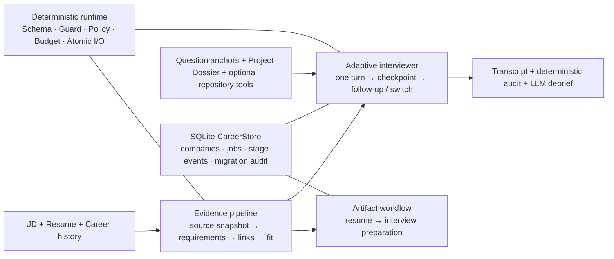

# Personal Career Workbench / Job Agent Harness

An evidence-grounded, artifact-first career workbench that keeps LLM semantic work
inside deterministic runtime contracts.

一个面向个人求职与技术面试准备的桌面 Agent 系统：用 LLM 处理 JD、简历证据和动态追问，
用 Python 管理权限、状态、事务、迁移、Schema、Guard、Checkpoint 与失败恢复。

> 面向 Agent 工程 / Agent 算法岗位展示。项目不会自动向公司投递，也不把工程测试或
> LLM Judge 分数表述为招聘效果、生产准确率或 SLA。

## 本次升级

- 新增 SQLite `CareerStore`：统一管理公司、岗位、阶段事件、artifact 链接、面试索引与迁移审计；
- 旧 session / tracker 采用非破坏、幂等迁移；无法可靠归属公司的记录进入待整理队列；
- 公司库成为桌面首页，可搜索、按优先级/标签筛选、查看岗位和面试，并从公司预填原有 JD + 简历流程；
- 普通 UI 固定使用实时 API：Key 只读取 `JOB_AGENT_LIVE_API_KEY`，未就绪时阻止生成，失败时无 offline/mock fallback；
- Evidence v2 将模型候选与确定性派生字段分离，使用不可变 source snapshot、exact quote resolver、provenance level cap 和 artifact projection；
- 模拟面试改为单 turn 动态 interviewer，可结合 JD、简历、Evidence、Project Dossier 与公开基础题 anchor 决定追问或换题；
- 面试完成后再生成整轮 debrief；面试记录只读上游 Evidence，不反向写入或污染 Evidence。

## 架构



详细责任边界见 [架构文档](docs/architecture.md)。

## 快速开始

要求 Python 3.10+。

```powershell
git clone https://github.com/YiFanWangSCU/job-agent-harness.git
cd job-agent-harness
python -m pip install -e ".[ui,dev]"
```

### 启动实时工作台

普通 UI 不提供 API Key 输入框，也不会读取 `glm.txt`。启动前把凭据和 skill 路径放入
当前进程环境；不要把真实值写入仓库。

```powershell
$env:JOB_AGENT_LIVE_API_KEY = "<your-key>"
$env:LLM_INTERN_SKILL_ROOT = "<approved-skill-package>"
# 可选：JOB_AGENT_LIVE_BASE_URL、JOB_AGENT_LIVE_MODEL、JOB_AGENT_OUTPUT_ROOT
streamlit run src/job_agent/ui/app.py
```

skill 目录必须包含 `SKILL.md` 与 `release-manifest.txt`。默认输出目录为
`output/workbench`，其中的 SQLite、session、checkpoint 与日志都不会进入 Git。

### 运行无网络开发 Demo

离线规则仍保留为 CLI fixture/replay 和测试能力，但不出现在普通产品 UI 中：

```powershell
powershell -NoProfile -ExecutionPolicy Bypass -File scripts/demo_local.ps1 `
  -OutputDir output/local_dev_demo
```

该命令只使用脱敏 fixture，不调用真实模型，也不代表产品生成路径存在 fallback。

### 启动异步 Backend Tracer

`feature/backend-service` 提供第二阶段的多用户异步纵向闭环：FastAPI 接收 Run，独立进程内
Worker 调用现有 `run_semantic_job_flow` 和 `MockLLMProvider`，再由 GET 返回进度与脱敏结果。

```powershell
python -m uvicorn job_agent.backend_service.main:app --app-dir src --host 127.0.0.1 --port 8000
```

Tracer 预置 `demo-user-a`、`demo-user-b`，开发请求使用受控 `X-User-ID`，简历引用为
`artifact://demo/resume`。创建接口必须携带 `Idempotency-Key`：

```text
POST /api/v1/runs
GET  /api/v1/runs/{run_id}
GET  /api/v1/runs/{run_id}/events
GET  /api/v1/runs/{run_id}/debug
POST /api/v1/runs/{run_id}/approve
POST /api/v1/runs/{run_id}/reject
POST /api/v1/runs/{run_id}/resume
```

这是 Mock Provider 学习闭环，不是生产身份系统：没有注册/登录、Approval API、PostgreSQL、
Redis 或崩溃恢复；进程重启会丢失 Run。生产配置不得信任任意 `X-User-ID`。

### 启动持久化 Backend 服务

第三阶段提供 PostgreSQL 状态权威、事务 Outbox、Redis Streams 唤醒、独立 Worker、Attempt
租约/心跳/围栏和私有 Checkpoint Adapter：

```powershell
docker compose -f compose.backend.yml up -d --build
docker compose -f compose.backend.yml ps
```

若默认 Python 包源在当前网络较慢，可显式传入镜像源；它只影响构建下载，不进入运行时合同：

```powershell
docker compose -f compose.backend.yml build `
  --build-arg PIP_INDEX_URL=https://pypi.tuna.tsinghua.edu.cn/simple
docker compose -f compose.backend.yml up -d
```

API 地址为 `http://127.0.0.1:8000`，请求合同与 Tracer 相同。Compose 仍只使用受控
`demo-user-a/demo-user-b` 和 Mock Provider；Redis 不是 Run 真相，API 创建 Run 时只要求
PostgreSQL 可用。停止服务但保留数据：

```powershell
docker compose -f compose.backend.yml stop
```

当前已提供 owner-scoped approve/reject/resume API、QUEUED per-user/global admission、
Provider 单调用级并发 permit、429 cooldown、熔断和 PostgreSQL 权威恢复。Checkpoint 写入也受
active Attempt lease fencing 保护；Redis reconciliation 不再要求整个 backlog 为空。仍无真实登录
身份或共享 PostgreSQL CareerStore；`UNCERTAIN` 禁止普通 resume，必须先人工核对外部副作用。

持久化 Worker 还提供 `application_assistant_flow` 的 Mock controller 纵向路径。它要求 Run 绑定
owner-scoped、不可变的 `career_snapshot_revision`，然后复用现有 `AgentLoop`、Policy、Approval digest、
Checkpoint 和 Tool Registry：先读取 Snapshot，再暂停审批，审批通过后只在
`/app/backend_data/{user_id}/{run_id}/sandbox` 生成草稿。Tool operation ledger 保存稳定 operation ID
与 observation receipt；若进程在 Tool 已执行但 receipt 未提交时崩溃，恢复会进入 `UNCERTAIN`，不会
盲目生成第二份草稿。

准确边界：当前没有公开 CareerSnapshot 写入 API，Snapshot 需由内部 Store/import seam 预置；
Application Assistant 尚未连接 DeepSeek，也不会发送真实邮件、填写表单或自动投递。本路径已通过
PostgreSQL/Redis Worker 重启集成测试，但本轮按计划尚未执行手工 HTTP/Compose 调用。

离线 Agent 级评测固定了 24 条 synthetic 场景，直接运行同一个 Mock controller、AgentLoop、Policy、
Approval、Checkpoint 和 sandbox Tool；其中 20 条预期成功，4 条模拟 Tool 已执行但 receipt 未返回。

```powershell
$env:PYTHONPATH='.;src'
python scripts/evaluate_application_assistant.py
```

本轮结果为 24/24 合同通过，审批前副作用和重复副作用均为 0；这不代表真实模型准确率或 API 性能。
评测口径与限制见
[Application Assistant Phase C 报告](docs/evidence/application_assistant_phase_c_eval_20260802_zh.md)。

`GET /api/v1/runs/{run_id}/debug` 提供 owner-scoped 脱敏 provenance：Manifest、Attempt、Approval、
Checkpoint 版本、Tool operation 和 Event 关联。它不返回请求正文、私人 Snapshot/Checkpoint payload、
Tool 参数/receipt、lease token、内部 Worker 名称或模型原始内容。实现后的单请求 Mock 与 DeepSeek Smoke
见 [Phase D Smoke 记录](docs/evidence/backend_service_phase_d_debug_smoke_20260802_zh.md)。最终大规模 HTTP、
1/2/4 Worker、Redis/PostgreSQL/Worker 故障和 queue cap 矩阵也已完成。

### 指标与可控压测

持久化 API 暴露聚合 Prometheus text 指标：

```text
GET /metrics
```

指标包含 HTTP 请求、availability 5xx、expected rejection 4xx、Run 状态、consumer-group
backlog、PEL、Stream retention、Provider/Worker latency、端到端 latency、retry、approval waiting
和 recovery。指标 Redis 写入是 best-effort，并在响应路径外执行；Redis 指标不可用不能阻断 Run API，
PostgreSQL 仍是业务状态权威。PostgreSQL 连接池获取超时收敛为 1 秒，运行期断库返回脱敏
`503 + Retry-After`。

Locust 必须安装在独立环境，避免改变应用依赖：

```powershell
python -m venv .venv-load
.\.venv-load\Scripts\python.exe -m pip install -r requirements.loadtest.txt
.\.venv-load\Scripts\python.exe -m locust -f load_tests\locustfile.py `
  --headless -u 10 -r 5 -t 15s --host http://127.0.0.1:8000
```

正常基线见 [第五阶段压测报告](docs/performance/backend_service_phase5_report_zh.md)，最终故障矩阵见
[最终负载与故障矩阵](docs/performance/backend_service_final_fault_matrix_20260802_zh.md)。报告中的 Mock
Provider 数据不代表真实模型 API 性能。

### DeepSeek Flash 单任务验证

持久化 Worker 可按 Run 中的 `provider_profile` 在 `mock` 与 `deepseek_flash` 之间路由。DeepSeek
适配器只允许官方 `https://api.deepseek.com/v1` 端点以及 `deepseek-chat` / `deepseek-reasoner`
模型；`deepseek_flash` 缺少凭据时明确失败为 `provider_credential_missing`，不会静默退回 Mock。

真实调用只建议做低并发 Canary，不做压力测试。凭据由 Worker 进程的 `API_KEY` 环境变量注入，
不要写进仓库、Compose 文件或命令行参数。Windows 本机开发可在启动 Worker 的同一 PowerShell
进程中从系统环境注入，但不要打印变量值：

```powershell
$env:API_KEY = [Environment]::GetEnvironmentVariable("API_KEY", "Machine")
python -m job_agent.backend_service.worker_main
```

创建 Run 时显式传入 `"provider_profile": "deepseek_flash"`。真实 Canary 的测量结果、调用边界
和不可追溯项见 [第六阶段 DeepSeek Canary 报告](docs/performance/backend_service_phase6_deepseek_canary_zh.md)。
当前 Compose 默认仍运行 Mock，不向容器传递宿主机凭据；生产部署应使用平台 Secret 注入。

### 多 Worker Mock 扩容实验

Load Compose 支持使用独立容器身份扩展 Worker，并允许仅在 Mock 实验中覆盖 Provider cap：

```powershell
docker compose -f compose.backend.yml -f compose.backend.load.yml up -d --scale worker=2 worker
```

种子脚本默认在 `demo-user-a/demo-user-b` 间轮询；报告脚本从 PostgreSQL 按唯一 batch 统计
Worker 分布、admission deferral、queue wait、E2E 分位数和用户完成偏斜：

```powershell
python scripts\seed_backend_load.py --runs 200 --batch-id example-batch
python scripts\report_backend_load.py --batch-id example-batch --expected-runs 200
```

测量表明，在两个活跃用户且 per-user cap=1 时，2 Worker 优于 4 Worker；继续扩容会增加
`provider_user_backpressure` 和数据库写放大。完整数据与 Outbox 延迟发布修复见
[第七阶段多 Worker 报告](docs/performance/backend_service_phase7_worker_scaling_zh.md)。
这是特定 cap 配置的容量结果，不表示同一用户必须绑定 Worker，也不构成 tenant 分片需求。
最终矩阵的普通 load 配置已使用 per-user cap=2；临时 cap=1 只用于制造 Checkpoint + provider
backpressure 恢复条件。Mock fixture 已按请求的输出 Schema 选择，不会在恢复跳过节点后错位。

Agent 应用方向的下一轮正确性、Domain Agent、Tool receipt 与评测计划见
[Agent 应用优化计划](docs/tech-specs/agent_application_optimization_plan_zh.md)，审计证据见
[Agent 应用方向审计](docs/evidence/backend_service_agent_application_audit_20260802_zh.md)。

Backend Worktree 最终聚焦回归为 `82 passed`；全量为 `283 passed / 19 failed / 2 warnings`。19 项均是
既有冻结 Evidence corpus 的 CRLF/byte-hash 差异，未修改冻结数据或 821 项回归口径。

## 关键工程合同

| 领域 | 合同 |
| --- | --- |
| Live readiness | 只认 `JOB_AGENT_LIVE_API_KEY`；缺 Key/skill root 时禁用生成；API 失败保留输入与 last-known-good |
| CareerStore | SQLite transaction；状态事件 append-only；legacy source hash 去重；迁移结果可审计 |
| Evidence v2 | 模型不生成 offset/hash/派生状态；Python exact-resolve quote、计算 hash 与 level cap |
| Adaptive interview | 每次只问一题；回答成为下一 turn observation；题目受 coverage、budget 和重复控制 |
| Tool use | Tool Registry schema、三层 allowlist、approval digest、budget、checkpoint、verifier |
| Artifact safety | 原子写入；上游 revision 触发 freshness；失败不覆盖旧 artifact |
| Backend tracer | `(user_id, Idempotency-Key)` 幂等；跨用户资源返回 404；HTTP 不等待 Agent 完成 |

## 验证结果

本公开仓库全量回归为 `244 passed, 2 warnings`：

```powershell
python -m pytest -q
```

开发工作区在 2026-08-01 的升级相关回归为 `135 passed`。修复 native LangGraph execution
schema 后，合并研发工作区全量为 `821 passed / 0 failed / 2 warnings`；graph/full-E2E
聚焦组为 `28 passed`。应用层 `checkpoint_id` 仍保留，但不再注册为 LangGraph channel。

Evidence v5 使用 20 个新 family、100 个 synthetic cases，并按 family 做 60/40
development/held-out 划分：

| Campaign | Pipeline completion | Req F1 | Link F1 | Fit |
| --- | ---: | ---: | ---: | ---: |
| GLM-5.2 development | 55/60 | 0.952 | 0.602 | 0.700 |
| Frozen held-out | 38/40 | 0.905 | 0.602 | 0.625 |

`38/40` 是 pipeline completion，不是准确率。数据是 synthetic benchmark；没有证明真实
简历泛化、人工 gold 一致性或招聘效果。公开仓库测试与完整口径见
[Evaluation](docs/evaluation.md)。

## 安全与范围

- 不提交 API Key、`.env`、`glm.txt`、真实简历、private output、SQLite、checkpoint、日志或原始模型响应；
- email / calendar / form 只保留 local/sandbox 语义，不执行真实 external write；
- 不实现语音、爬虫、云同步、自动投递、第二阶段题库 CRUD/导出或生产级多租户；
- 学习笔记与私人面试材料不作为 runtime Evidence source，也不包含在此公开镜像；
- LoRA adapter 只通过 runtime gate，冻结 held-out quality gate 失败，不能宣称训练有效。

更多说明见 [安全边界](docs/security-boundaries.md) 与
[当前事实](docs/evidence/current_status.md)。

## 仓库导航

- [架构与责任分层](docs/architecture.md)
- [评测设计、命令与口径](docs/evaluation.md)
- [安全与能力边界](docs/security-boundaries.md)
- [当前事实与已知限制](docs/evidence/current_status.md)
- [离线开发 Demo](demo/README.md)
- [脱敏 Fixture](data/fixtures/)

## License

本项目采用 [MIT License](LICENSE)。
