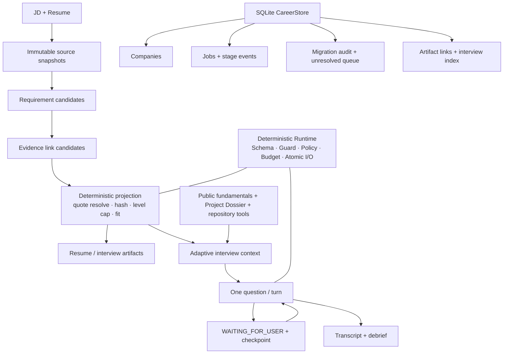

# 架构与数据流

项目将 LLM 的开放语义职责与 Python 的确定性执行职责分开。模型可以理解、比较、提问；
程序拥有 source of truth、权限、副作用、事务、派生字段、失败语义与验收权。



## 四个核心模块

### CareerStore

`src/job_agent/career/` 使用标准库 `sqlite3` 保存关系索引，而正文 artifact 继续保留为文件。

- 公司使用规范化名称去重，支持优先级、标签、备注和归档；
- 岗位关联公司、legacy job id 与 session 路径；
- 阶段变化追加为 event，在同一 transaction 内更新当前投递状态；
- legacy session / tracker 按 source hash 幂等迁移，未知或冲突公司进入待整理；
- migration run、item、artifact link 与 interview index 都可审计。

迁移不覆盖、不删除旧 session/tracker，也不双写 legacy JSON。

### Evidence v2

Evidence v2 把模型候选与持久化 artifact 分开：

```text
LLM candidate
  exact quote + semantic label + rationale
        ↓
Python materialization
  source lookup → unique quote resolve → offsets/hash → provenance cap
        ↓
Persisted evidence_current.json + downstream projections
```

模型 schema 不包含 numeric offset、hash、`match_status`、`has_contradiction` 或
`independence_group`。这些可确定字段由 Python 计算；quote 不唯一、source 不存在、snapshot
过期或 level 超出来源上限时 repair/fail closed。

### Adaptive Interview

`src/job_agent/interview/` 生成一次面试的 frozen context snapshot。Interviewer 每个 turn
只选择一个动作：追问、切换主题、使用允许的只读工具补充上下文，或结束。

问题来源不是单一 Evidence 列表：

- JD requirements 与 Evidence 作为岗位相关来源；
- 简历项目经 `ProjectDossier` 形成可追问的架构、取舍、指标和故障点；
- 内置公开基础题只作为 anchor，不机械随机抽题；
- 允许的 repository/source 工具可按需读取材料，但受 allowlist、budget 与 timeout 约束。

面试 transcript 和 debrief 不回写 Evidence。Evidence 对 Interview 是单向只读依赖。

### Live-only UI

普通 Streamlit UI 固定走 `AGENT_API_LIVE`。`offline_rule` 与 `agent_api/mock` 只保留在
CLI fixture、测试 helper 和 replay 中。

```text
check_live_runtime
  → JOB_AGENT_LIVE_API_KEY present?
  → approved skill root valid?
  → base URL / model valid?
  → ready: build runtime and generate
  → not ready: disable action, keep form state, no fallback
```

## Tool Action 与失败提交

```text
Model decision → ToolRegistry schema → allowlist → Policy / Approval
→ ToolExecutor → typed observation → Verifier → checkpoint / next / finish
```

Approval 绑定 action digest、session 与 run，参数变化会使旧批准失效。关键 live 动作遵循：

```text
read last-known-good
→ generate
→ schema / Guard / policy checks
→ atomic write
→ freshness update
```

模型、网络、Schema、Guard 或写入任一步失败时终止当前动作，不产生离线替代 artifact，
并保留用户输入和上一成功版本。
